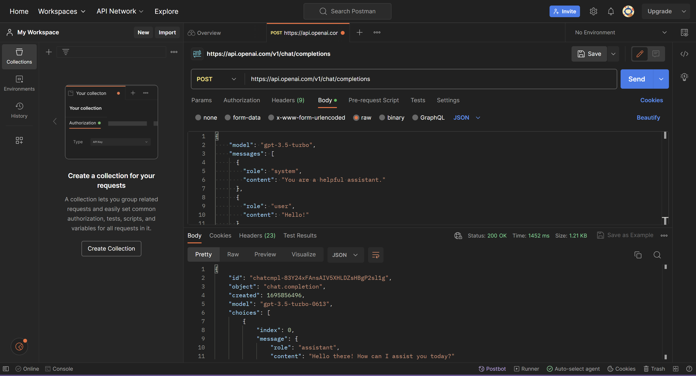

# exploring-apis-activity

Problem Domain:
A notetaking app where you can use an AI api to do things like add graphics, diagrams,
code snippets, and more. 

We're creating a Java web application which will open initially to a login page. Users can 
login to see a folder containing all of their notes. They can search for notes by title, 
they can edit old notes and they can create new notes. Within each note, they can use the 
special features. We're also looking into trying to make the code-snippets able to run by 
integrating an online compiler, but we're not sure how feasible it is to use that API. 

API Links
https://www.hackerearth.com/docs/wiki/developers/v4/
https://platform.openai.com/docs/introduction

